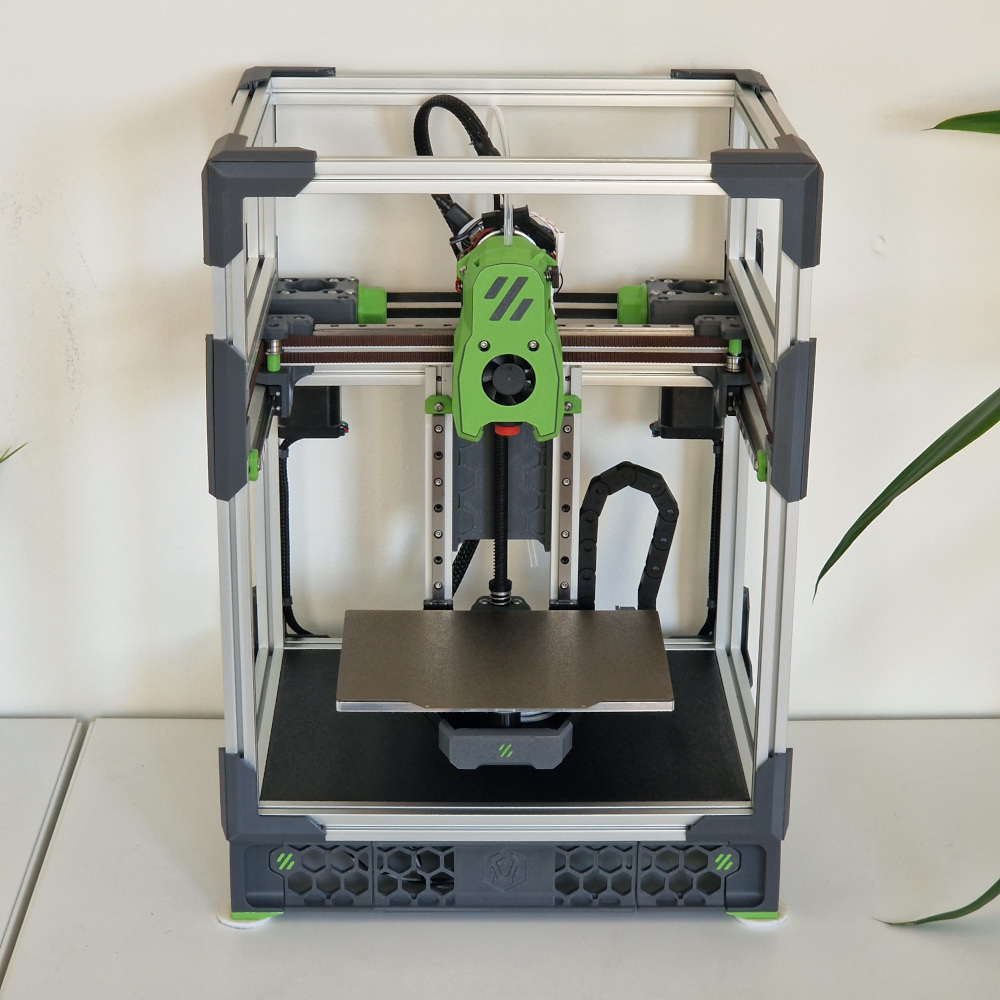
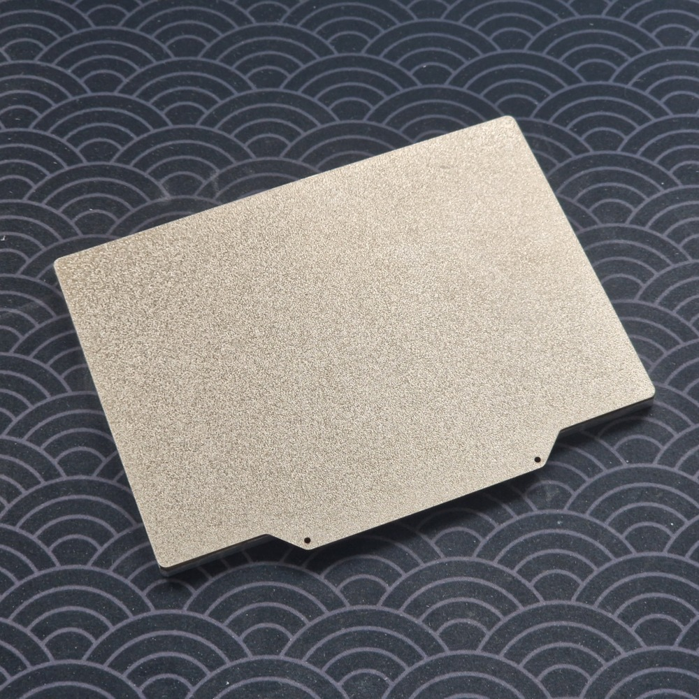
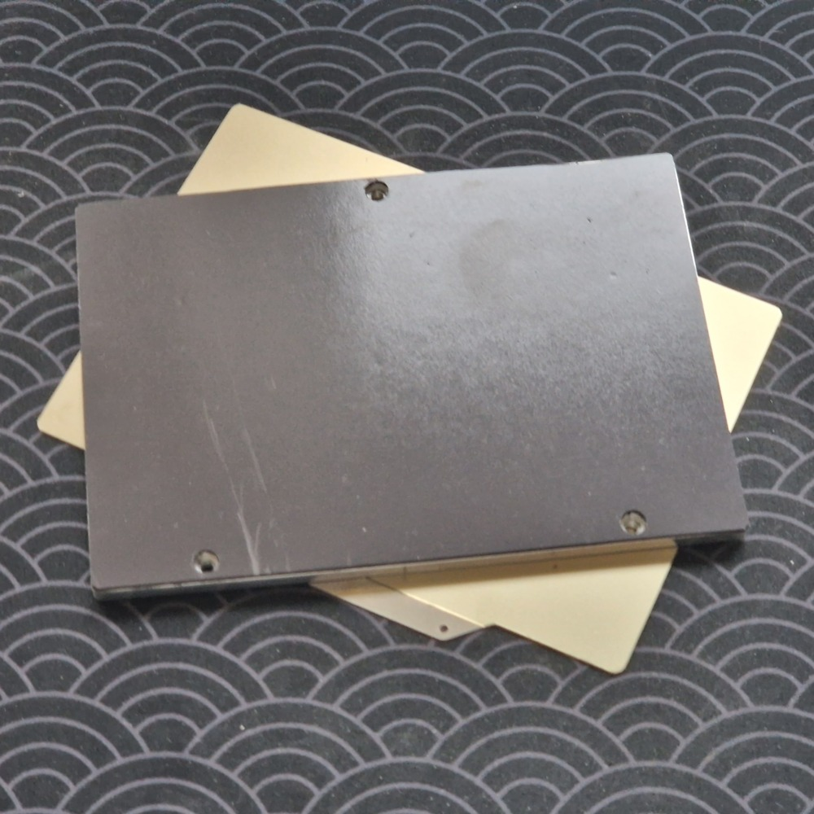
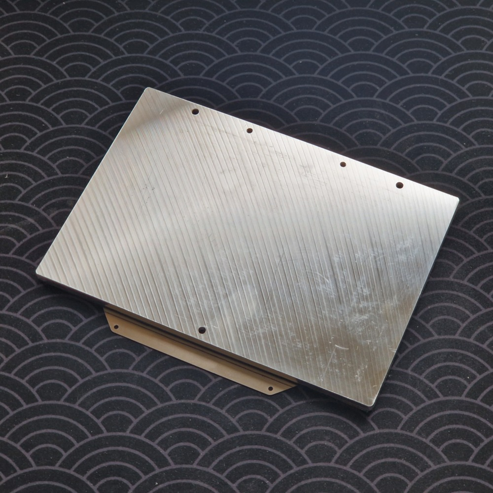

# Voron V0 170mm Build Plate Mod
This mod contains the technical drawings for a 170x120mm build plate for the Voron V0 3D printer.

It adds a bit of build area over the standard 120x120mm build plate of the stock Voron V0.

The aluminum build plate in this repository is 5mm thick, but it should be easy enough to adapt the CAD model in the step file to your needs using any standard CAD program.

The dimensions of the heater are modeled after Keenovos stock V0 heater but the sides have been extended to cover the full width of the 170mm build plate.

You need to custom order all the parts, but overall I found the process as well as the prices to be reasonable. I did not pay much more than I would have for stock parts from the same suppliers.

## Sourcing the build plate
Many shops will be able to mill a custom build plate for you, but some of the most commonly recommended include:

[Mandala Rose Works (Minnesota, US)](https://mandalaroseworks.com/)

[Clever3D (Germany, EU)](https://clever3d.de/)

## Sourcing the heater
I recommend sourcing the heater from Keenovo. Contact them via email, include the drawing for the heater and specify that it is for a 3D printer. I recommend going with a total power of 150W for 5-6mm thick build plates and 200W for 8mm build plates. They should be able to help you from there.

[Keenovo (Shanghai, China)](https://keenovo.store/)

## Sourcing the PEI sheet and magnetic surface
I recommend getting a custom cut PEI sheet from Energetic 3D on AliExpress. You can contact them using the AliExpress Message Center feature and they will let you specify coating and dimensions for your custom build surface.

[Energetic 3D (Shenzhen, China)](https://energetic3d.aliexpress.com)

## Other
Please let me know if you have issues or if you find other great sourcing partners.

## Pictures

